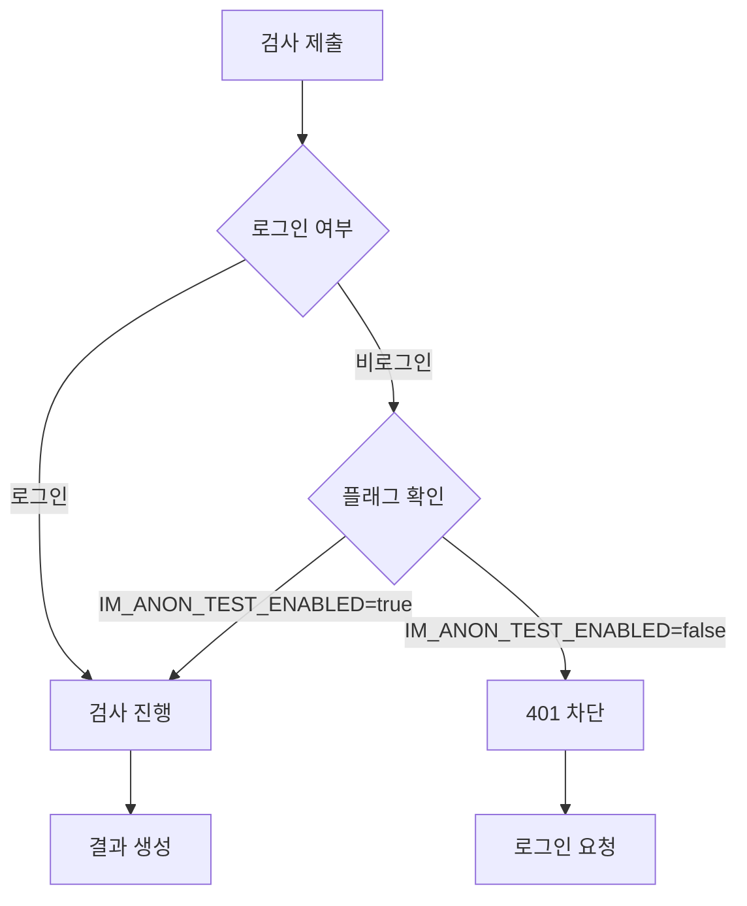

# 익명 검사 플래그 기능

**작성일**: 2025-01-27  
**브랜치**: `feature/anon-guard`  
**기준 커밋**: `ff3cc05` (J46vP5QGc 빌드)

---

## 📋 개요

익명 검사 기능을 **환경 변수 플래그**로 제어할 수 있도록 구현했습니다.

- **기본값**: `false` (익명 검사 차단)
- **활성화**: `IM_ANON_TEST_ENABLED=true` 설정 시 익명 검사 허용
- **향후 확장**: 쿠키 + ownerToken 방식으로 확장 예정

---

## 🔧 구현 내용

### 1. 환경 변수 추가

**파일**: `env.example.txt`

```env
# Feature Flags
IM_ANON_TEST_ENABLED=false  # 익명 검사 플래그 (기본: OFF)
```

**로컬 설정** (`.env.local`):
```bash
IM_ANON_TEST_ENABLED=false
```

**Vercel 설정**:
- Project Settings → Environment Variables
- `IM_ANON_TEST_ENABLED` = `false`
- Production, Preview, Development 모두 적용

---

### 2. API 가드 추가

**파일**: `src/app/api/test/analyze/route.ts`

```typescript
// 익명 검사 플래그 (기본값: false)
const ANON_ENABLED = process.env.IM_ANON_TEST_ENABLED === "true";

export async function POST(req: Request) {
  try {
    const session = await getServerSession(authOptions);
    
    // 🔒 익명 검사 가드: 로그인 없고 플래그도 OFF면 차단
    if (!session?.user && !ANON_ENABLED) {
      console.log("🚫 [API /test/analyze] Anonymous test blocked (flag OFF)");
      return NextResponse.json(
        { 
          error: "LOGIN_REQUIRED", 
          message: "로그인이 필요합니다. 익명 검사는 현재 비활성화되어 있습니다." 
        },
        { status: 401 }
      );
    }
    
    // ... 기존 로직 계속
  }
}
```

---

## 🧪 테스트 시나리오

### ✅ Case 1: 로그인 사용자 (플래그 OFF)
```bash
# 환경 변수
IM_ANON_TEST_ENABLED=false

# 테스트
1. 로그인
2. /test/questions 접근
3. 55문항 답변
4. 검사 제출

# 예상 결과
✅ 200 OK - 검사 성공
```

### ✅ Case 2: 비로그인 사용자 (플래그 OFF)
```bash
# 환경 변수
IM_ANON_TEST_ENABLED=false

# 테스트
1. 로그아웃 상태
2. /test/questions 접근
3. 55문항 답변
4. 검사 제출

# 예상 결과
❌ 401 Unauthorized
{
  "error": "LOGIN_REQUIRED",
  "message": "로그인이 필요합니다. 익명 검사는 현재 비활성화되어 있습니다."
}
```

### ✅ Case 3: 비로그인 사용자 (플래그 ON)
```bash
# 환경 변수
IM_ANON_TEST_ENABLED=true

# 테스트
1. 로그아웃 상태
2. /test/questions 접근
3. 55문항 답변
4. 검사 제출

# 예상 결과
✅ 200 OK - 검사 성공 (익명 모드)
```

---

## 📊 동작 흐름



---

## 🚀 배포 전략

### 1. 로컬 테스트
```bash
# .env.local 설정
IM_ANON_TEST_ENABLED=false

# 서버 실행
npm run dev

# 테스트
- 로그인 사용자: 검사 성공 확인
- 비로그인 사용자: 401 에러 확인
```

### 2. Vercel Preview 배포
```bash
git push origin feature/anon-guard

# Vercel에서 자동 Preview 배포
# Environment Variables 확인:
# IM_ANON_TEST_ENABLED=false
```

### 3. Production 배포
```bash
# PR 승인 후 main 브랜치 머지
# Vercel Production 배포 시 환경 변수 확인:
# IM_ANON_TEST_ENABLED=false
```

---

## 🔮 향후 확장 계획

### Phase 2: Owner Token 시스템 (예정)

**목표**: 익명 사용자도 검사 후 결과를 조회할 수 있도록

**구현 내용**:
1. 익명 검사 생성 시 `ownerToken` 발급
2. HTTPOnly 쿠키에 토큰 저장
3. 결과 조회 시 토큰 검증
4. 로그인 후 계정 연결 기능

**플래그 설정**:
```env
IM_ANON_TEST_ENABLED=true  # Phase 2에서 활성화
```

---

## 📝 체크리스트

- [x] 환경 변수 추가 (`IM_ANON_TEST_ENABLED`)
- [x] API 가드 구현 (`/api/test/analyze`)
- [x] 문서 작성
- [ ] 로컬 테스트 (로그인/비로그인)
- [ ] Vercel Preview 테스트
- [ ] PR 생성
- [ ] 코드 리뷰
- [ ] Production 배포

---

## 🐛 트러블슈팅

### Q: 플래그를 변경했는데 반영이 안 됩니다.
**A**: 서버를 재시작하세요.
```bash
# Ctrl+C로 서버 종료 후
npm run dev
```

### Q: Vercel에서 플래그가 작동하지 않습니다.
**A**: Environment Variables 설정을 확인하세요.
1. Vercel Dashboard → Project Settings
2. Environment Variables 탭
3. `IM_ANON_TEST_ENABLED` 값 확인
4. Redeploy 실행

### Q: 로그인 사용자도 차단됩니다.
**A**: 세션 확인 로직을 점검하세요.
```typescript
// session?.user가 올바르게 설정되어 있는지 확인
console.log("Session:", session);
```

---

**작성자**: InnerMap AI Development Team  
**모델**: Claude Sonnet 4.5

