```mermaid
erDiagram
    users {
        uuid id PK
        text email UK
        text name
        text image
        text provider
        text provider_id
        integer level
        integer exp_current
        integer exp_next
        timestamptz created_at
        timestamptz updated_at
    }

    user_profiles {
        uuid user_id PK,FK
        text gender
        date birthdate
        text email
        timestamptz consent_required_at
        timestamptz consent_marketing_at
        timestamptz created_at
        timestamptz updated_at
    }

    test_assessments {
        uuid id PK
        uuid user_id FK
        text engine_version
        jsonb raw_answers
        timestamptz completed_at
        timestamptz created_at
    }

    test_assessment_results {
        uuid assessment_id PK,FK
        text mbti
        jsonb big5
        text[] keywords
        jsonb inner9
        jsonb world
        numeric confidence
        timestamptz created_at
    }

    ai_reports {
        uuid id PK
        uuid user_id FK
        uuid test_result_id FK
        text report_type
        text status
        text summary_md
        jsonb visual_data
        timestamptz created_at
        timestamptz updated_at
    }

    email_jobs {
        uuid id PK
        uuid user_id FK
        uuid assessment_id FK
        text template
        text status
        integer retry_count
        timestamptz created_at
    }

    plan_subscriptions {
        uuid id PK
        uuid user_id FK
        text plan_type
        text stripe_customer_id
        text stripe_subscription_id
        text status
        timestamptz current_period_end
        timestamptz created_at
        timestamptz updated_at
    }

    waitlist {
        uuid id PK
        text email UK
        text name
        text status
        timestamptz created_at
    }

    %% 관계 ì •ì˜
    users ||--o{ user_profiles : "has profile"
    users ||--o{ test_assessments : "creates"
    users ||--o{ ai_reports : "owns"
    users ||--o{ email_jobs : "receives"
    users ||--o{ plan_subscriptions : "subscribes"
    
    test_assessments ||--|| test_assessment_results : "generates"
    test_assessments ||--o{ email_jobs : "triggers"
    
    test_assessment_results ||--o{ ai_reports : "analyzed_in"
```

# InnerMap AI v2 - 데이터베이스 ERD

> **최종 업데이트**: 2025-01-27  
> **상태**: 테이블 정리 완료

## 🎯 **통합된 테이블 구조**

### 핵심 테이블 (최종)



## 📊 **테이블 상세 설명**

### 1. **users** - 사용자 기본 정보
- **역할**: OAuth 로그인 사용자 관리
- **특징**: 레벨/경험치 시스템 포함
- **관계**: 모든 테이블의 중심

### 2. **user_profiles** - 사용자 프로필
- **역할**: 검사용 프로필 정보 (성별, 생년월일)
- **특징**: GDPR 동의 관리
- **관계**: users와 1:1

### 3. **test_assessments** - 검사 기록
- **역할**: 55문항 원시 응답 저장
- **특징**: 엔진 버전별 재현 가능
- **관계**: test_assessment_results와 1:1

### 4. **test_assessment_results** - 검사 결과
- **역할**: 분석된 결과 데이터 (MBTI, Big5, Inner9)
- **특징**: JSONB로 유연한 데이터 저장
- **관계**: test_assessments와 1:1

### 5. **ai_reports** - AI 리포트
- **역할**: 심층 분석 리포트
- **특징**: 비동기 생성, 상태 관리
- **관계**: users, test_results와 연결

### 6. **email_jobs** - 이메일 큐
- **역할**: 리포트 이메일 발송 관리
- **특징**: 재시도 로직 포함
- **관계**: users, test_assessments와 연결

### 7. **plan_subscriptions** - 구독 관리
- **역할**: Stripe 구독 상태 관리
- **특징**: 요금제별 접근 제어
- **관계**: users와 1:1

### 8. **waitlist** - 대기자 목록
- **역할**: 베타 서비스 대기자 관리
- **특징**: 독립적 테이블
- **관계**: 없음

## 🔄 **호환성 뷰**

### test_results_v
- **목적**: 기존 코드 호환성
- **구조**: test_assessments + test_assessment_results 조인
- **사용**: 기존 API에서 seamless 전환

## 🗑️ **제거된 테이블**

### ❌ **assessments** (제거됨)
- **이유**: test_assessments와 중복
- **마이그레이션**: 데이터는 test_assessments로 이동

### ❌ **results** (제거됨)  
- **이유**: test_assessment_results와 중복
- **마이그레이션**: 데이터는 test_assessment_results로 이동

### ❌ **test_results** (보존됨)
- **이유**: 기존 코드 호환성
- **대체**: test_results_v 뷰로 대체

## 🔐 **보안 정책 (RLS)**

### 활성화된 테이블
- `test_assessments` - 사용자별 접근 제어
- `test_assessment_results` - 사용자별 접근 제어
- `user_profiles` - 사용자별 접근 제어
- `ai_reports` - 사용자별 접근 제어

### 정책 내용
- **SELECT**: 본인 데이터만 조회 가능
- **INSERT**: 본인 데이터만 생성 가능
- **UPDATE**: 본인 데이터만 수정 가능
- **DELETE**: 본인 데이터만 삭제 가능

## 📈 **성능 최적화**

### 인덱스 전략
```sql
-- 사용자별 최신 검사 조회
CREATE INDEX idx_test_assessments_user_created 
  ON test_assessments(user_id, created_at DESC);

-- MBTI별 통계 조회
CREATE INDEX idx_test_assessment_results_mbti 
  ON test_assessment_results(mbti);

-- 이메일 조회 최적화
CREATE INDEX idx_users_email ON users(email);
```

## 🚀 **마이그레이션 완료**

### ✅ **완료된 작업**
1. 중복 테이블 제거 (`assessments`, `results`)
2. 데이터 마이그레이션 (기존 → 신규)
3. 호환성 뷰 생성 (`test_results_v`)
4. RLS 정책 업데이트
5. 인덱스 최적화

### ✅ **API 업데이트**
- `/api/imcore/me` - 통합 뷰 사용
- 기존 코드 호환성 유지
- 성능 최적화

## 📋 **사용 가이드**

### 새로운 검사 저장
```sql
-- 1. 검사 기록 저장
INSERT INTO test_assessments (user_id, raw_answers, ...);

-- 2. 결과 저장  
INSERT INTO test_assessment_results (assessment_id, mbti, big5, ...);
```

### 검사 결과 조회
```sql
-- 통합 뷰 사용 (권장)
SELECT * FROM test_results_v WHERE user_id = ?;

-- 또는 직접 조인
SELECT ta.*, tar.* 
FROM test_assessments ta
JOIN test_assessment_results tar ON ta.id = tar.assessment_id
WHERE ta.user_id = ?;
```

---

**결론**: 테이블 구조가 깔끔하게 정리되었고, 기존 코드 호환성도 유지됩니다! 🎉
